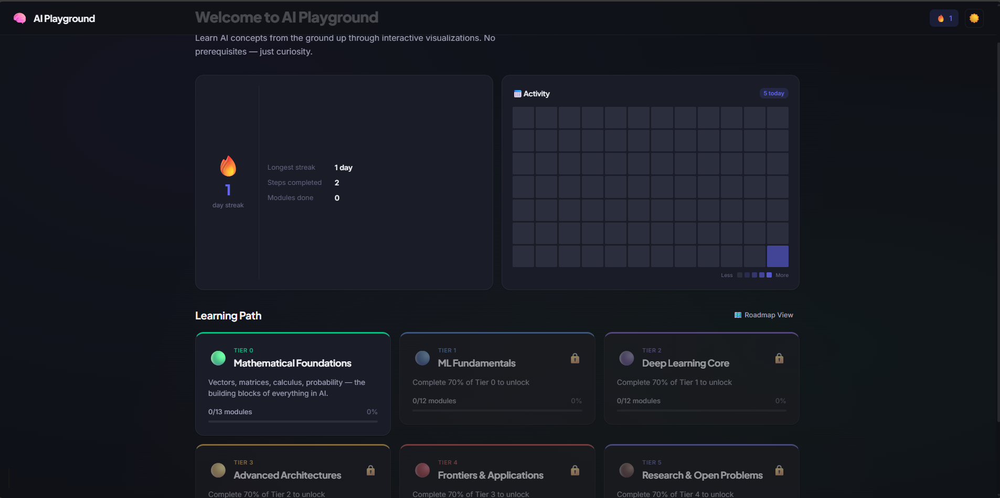
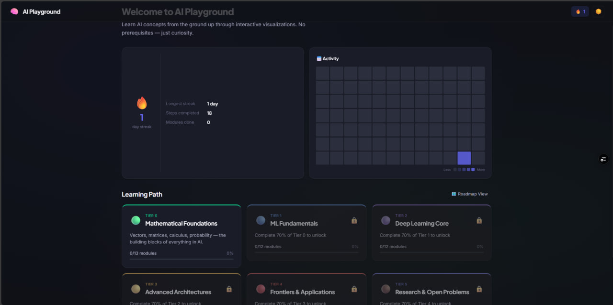
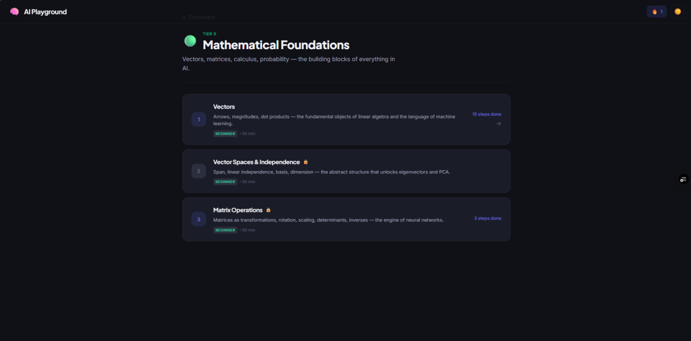
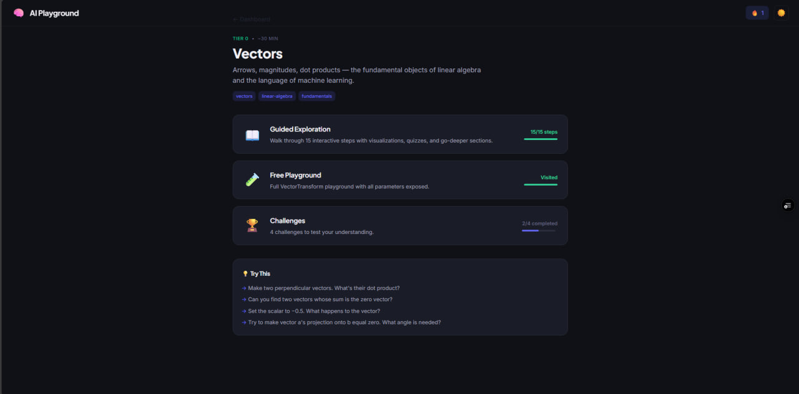
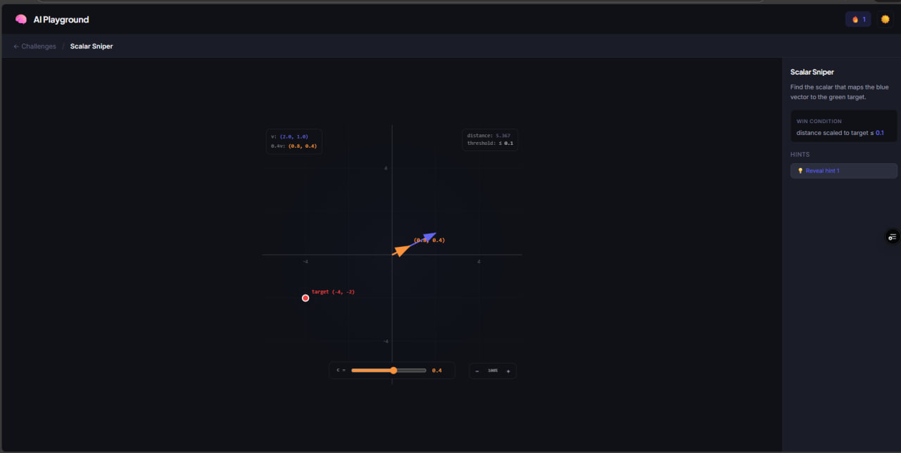

<p align="center">
  
</p>

<h1 align="center">🧠 AI Playground</h1>

<p align="center">
  <strong>Learn AI from the ground up through interactive visualizations — not just theory.</strong>
</p>

<p align="center">
  <a href="#features">Features</a> •
  <a href="#screenshots">Screenshots</a> •
  <a href="#curriculum">Curriculum</a> •
  <a href="#tech-stack">Tech Stack</a> •
  <a href="#getting-started">Getting Started</a> •
  <a href="#roadmap">Roadmap</a>
</p>

---

## What is AI Playground?

AI Playground is an interactive learning platform that teaches the math and concepts behind AI/ML through **hands-on visual explorations**. Instead of staring at textbook equations, you drag vectors, slide scalars, watch matrix transformations happen in real-time, and build genuine intuition for the math that powers modern AI.

Every concept is a **guided step** with:

- A clear, concise explanation
- An interactive SVG visualization you can manipulate
- A "Go Deeper" section with LaTeX math and formal definitions
- Inline quizzes to test understanding
- Challenges that push you to apply what you learned

---

## Screenshots

<table>
  <tr>
    <td align="center"><br /><strong>Dashboard</strong><br />Track progress, streaks, and activity</td>
    <td align="center"><br /><strong>Tier Overview</strong><br />Browse modules within each tier</td>
  </tr>
  <tr>
    <td align="center"><br /><strong>Module Hub</strong><br />Guided lessons, playground, and challenges</td>
    <td align="center"><br /><strong>Playground Mode</strong><br />Free-form exploration with toggleable params</td>
  </tr>
  <tr>
    <td align="center" colspan="2"><br /><strong>Challenges</strong><br />Drag-to-solve puzzles to test your skills</td>
  </tr>
</table>

---

## Features

| Feature                           | Description                                                                       |
| --------------------------------- | --------------------------------------------------------------------------------- |
| 🎯 **Interactive Visualizations** | Drag vectors, adjust sliders (scalar, c₁/c₂), zoom & pan — all in custom SVG      |
| 📖 **Guided Lessons**             | Step-by-step walkthroughs with explanations, LaTeX math, and author notes         |
| ❓ **Inline Quizzes**             | Test understanding after each concept with instant feedback                       |
| 🏆 **Challenges**                 | Hands-on puzzles: match targets, make vectors perpendicular, find the right basis |
| 🎮 **Playground Mode**            | Free-form exploration with toggleable parameters                                  |
| 📊 **Progress Tracking**          | Streak counter, activity calendar, completion percentages — all saved locally     |
| 🌙 **Dark / Light Mode**          | Full theme support with glassmorphic UI                                           |
| 🔍 **SEO Optimized**              | Open Graph, Twitter cards, dynamic sitemap, PWA manifest                          |
| 🔒 **Prerequisite System**        | Modules unlock progressively as you complete prerequisites                        |

---

## Curriculum

The curriculum is structured into **6 progressive tiers**, from mathematical foundations to cutting-edge research:

```
🟢 Tier 0 — Mathematical Foundations
     ├── Vectors (15 steps) ✅
     ├── Matrices (12 steps) ✅
     ├── Vector Spaces & Independence (12 steps) ✅
     ├── Eigenvalues & Eigenvectors (coming soon)
     ├── Calculus for ML (coming soon)
     └── Probability & Statistics (coming soon)

🔵 Tier 1 — ML Fundamentals
🟣 Tier 2 — Deep Learning Core
🟡 Tier 3 — Advanced Architectures
🔴 Tier 4 — Frontiers & Applications
🟤 Tier 5 — Research & Open Problems
```

### Currently Available Modules

**Vectors** — Components, magnitude, angle, addition, subtraction, scalar multiplication, dot product, perpendicularity, projection, linear combinations

**Matrices** — Matrix-vector multiplication, geometric transformations, determinants, inverses, eigenvalue preview

**Vector Spaces & Independence** — Span (1D & 2D), linear dependence/independence, basis, custom basis, dimension, subspaces, change of basis, connections to AI (word embeddings, PCA)

---

## Tech Stack

| Technology                                    | Purpose                                                                   |
| --------------------------------------------- | ------------------------------------------------------------------------- |
| [Next.js 16](https://nextjs.org/)             | App Router, Turbopack, SSR/SSG                                            |
| [TypeScript](https://www.typescriptlang.org/) | Strict typing throughout                                                  |
| **Custom SVG Engine**                         | Hand-built interactive vector/matrix visualizations (no charting library) |
| [KaTeX](https://katex.org/)                   | LaTeX math rendering in "Go Deeper" sections                              |
| **localStorage**                              | Client-side progress persistence                                          |
| **CSS Variables**                             | Full theming system (dark/light mode)                                     |

---

## Getting Started

### Prerequisites

- Node.js 18+
- npm, yarn, pnpm, or bun

### Installation

```bash
# Clone the repository
git clone https://github.com/jajos12/aiai.git
cd aiai

# Install dependencies
npm install

# Start the development server
npm run dev
```

Open [http://localhost:3000](http://localhost:3000) in your browser.

### Build for Production

```bash
npm run build
npm start
```

---

## Project Structure

```
src/
├── app/                    # Next.js App Router pages
│   ├── layout.tsx          # Root layout with global metadata
│   ├── page.tsx            # Dashboard (home)
│   ├── manifest.ts         # PWA manifest
│   ├── robots.ts           # robots.txt
│   ├── sitemap.ts          # Dynamic sitemap
│   └── tier/[tierId]/      # Tier & module routes
│       └── [moduleId]/
│           ├── guided/     # Step-by-step lessons
│           ├── playground/ # Free exploration
│           └── challenge/  # Hands-on puzzles
├── components/
│   ├── visualizations/     # VectorTransform, MatrixTransform (custom SVG)
│   ├── lesson/             # StepViewer, GoDeeper, QuizBlock, AuthorNote
│   ├── dashboard/          # TierCard, StreakCounter, ActivityCalendar
│   └── layout/             # TopNav, Footer
├── content/
│   ├── registry.ts         # Module registry (lazy loading)
│   └── tier0/
│       ├── vectors/        # Vectors module (15 steps)
│       ├── matrices/       # Matrices module (12 steps)
│       └── vector-spaces/  # Vector Spaces module (12 steps)
├── hooks/                  # useLesson, useProgress, useTheme, useZoom
└── types/                  # TypeScript interfaces (curriculum, progress)
```

---

## Adding a New Module

Every module is a single TypeScript file. To add one:

1. Create `src/content/tier0/your-module/module.ts`
2. Export a `Module` object with steps, quizzes, challenges, and playground config
3. Register it in `src/content/registry.ts`

```typescript
// src/content/tier0/your-module/module.ts
import type { Module } from "@/types/curriculum";

const yourModule: Module = {
  id: "your-module",
  tierId: 0,
  clusterId: "linear-algebra",
  title: "Your Module Title",
  // ... steps, playground, challenges
};

export default yourModule;
```

---

## Roadmap

- [ ] Eigenvalues & Eigenvectors module
- [ ] Calculus for ML (interactive gradient descent)
- [ ] 3D vector space visualizations
- [ ] Neural Network Playground (build & train visually)
- [ ] Transformer Attention visualization
- [ ] URL gating for prerequisite enforcement
- [ ] Mobile PWA with offline support
- [ ] User accounts & cloud progress sync

---

## License

This project is open source. Feel free to use it for learning, teaching, or building upon.

---

<p align="center">
  <em>The math behind AI shouldn't feel like a wall. It should feel like a playground.</em> 🎮
</p>
