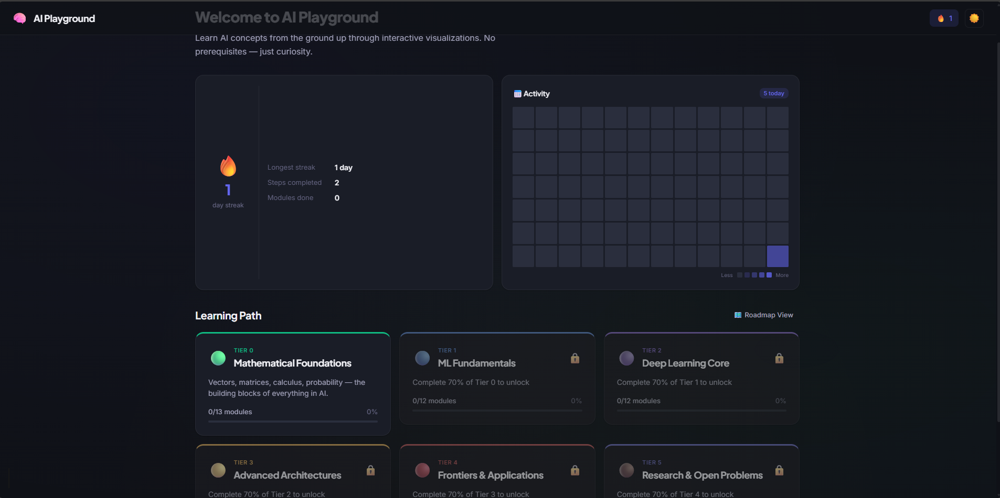
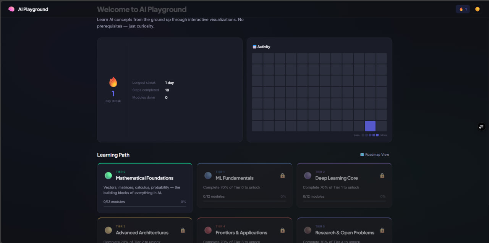
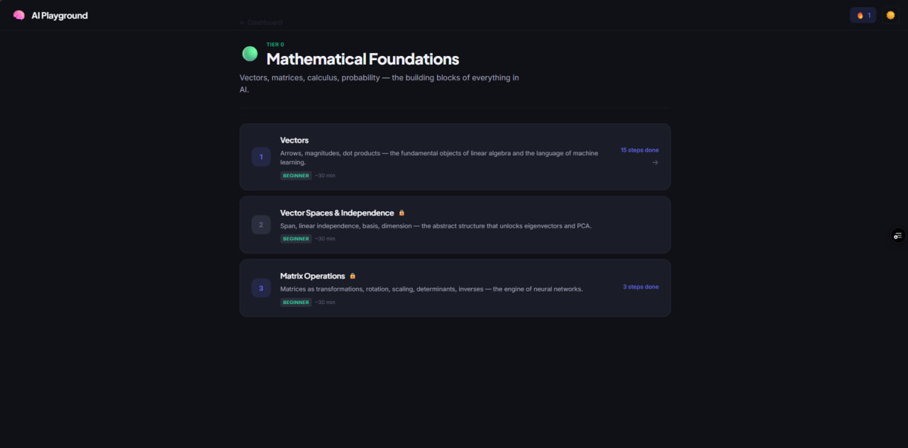
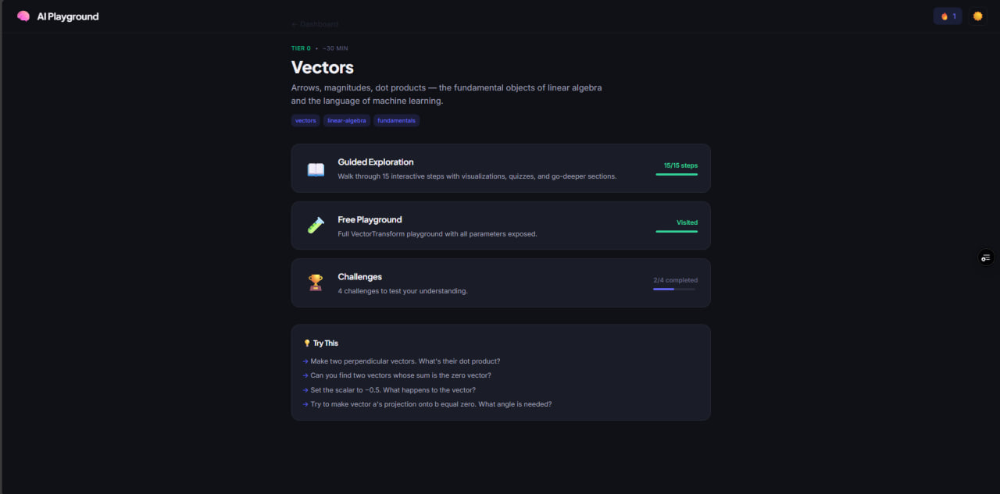
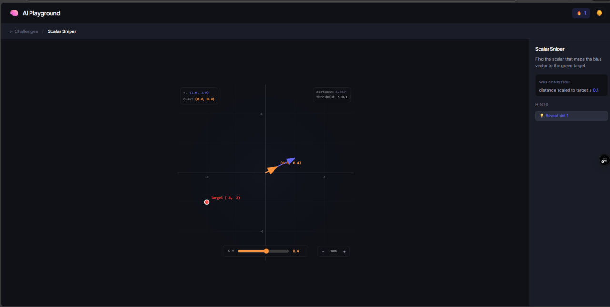
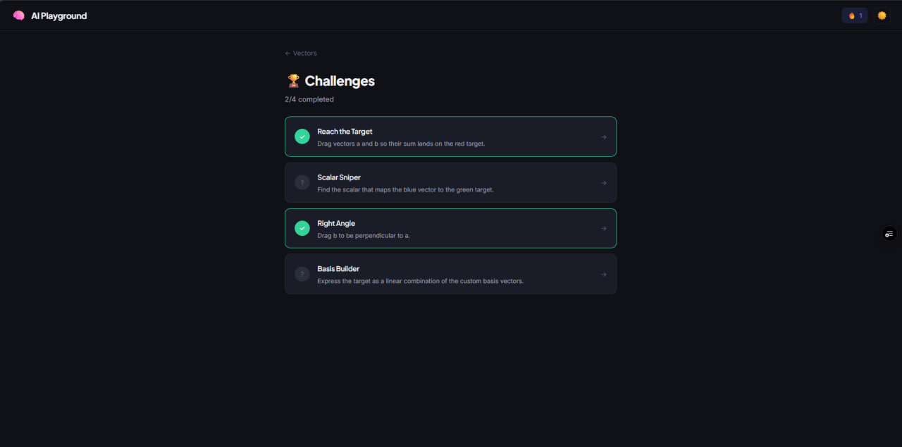

<p align="center">
  
</p>
<p>
  [Demo video of Eigen vectors module](https://github.com/user-attachments/assets/53b13cae-692a-4934-8b78-2931b5227172)
</p>
<h1 align="center">AI Playground</h1>

<p align="center">
  <strong>Interactive AI and math lessons built around visual intuition.</strong>
</p>

<p align="center">
  <a href="#overview">Overview</a> •
  <a href="#current-curriculum">Current Curriculum</a> •
  <a href="#project-structure">Project Structure</a> •
  <a href="#getting-started">Getting Started</a> •
  <a href="#authoring-modules">Authoring Modules</a>
</p>

---

## Overview

AI Playground is a Next.js App Router application for learning AI concepts through interactive visualizations instead of static notes alone. Each module combines:

- guided steps with concise explanations
- interactive visualizations
- optional "Go Deeper" math sections
- playground exploration
- challenge-based practice

The app currently stores learner progress locally in `localStorage`, generates public module routes from the module registry, and uses tier metadata to drive the dashboard and unlock flow.

### Current source of truth

If docs disagree, trust the code in these places:

- `src/core/registry.ts` for module registration and Tier 0 module metadata
- `src/core/curriculum.ts` for tier metadata and unlock rules
- `src/modules/*` for the actual lesson implementations

Older planning files in `docs/` are preserved as historical references only.

---

## Current Curriculum

The live app currently ships these Tier 0 modules:

| Module ID | Title | Focus |
| --- | --- | --- |
| `vectors` | Vectors | Vector basics, magnitude, dot product, projections |
| `vector-spaces` | Vector Spaces | Span, independence, basis, dimension |
| `matrices` | Matrices | Matrix transforms, determinants, inverses |
| `eigenvalues` | Eigenvalues & Eigenvectors | Eigenspaces, decomposition, power iteration |
| `optimization` | Optimization & Gradient Descent | Loss landscapes, optimizers, partial derivatives |
| `chain-rule` | The Chain Rule | Computation graphs and gradient flow |

Tier 1 through Tier 5 are defined in the curriculum metadata, but their module catalogs have not been populated yet.

### Learning flow

The current route flow is:

1. dashboard
2. tier overview
3. module hub
4. guided, playground, or challenge mode

Those public routes are generated from the registered modules, and the sitemap is built from that same runtime data.

---

## Screenshots

<table>
  <tr>
    <td align="center"><br /><strong>Dashboard</strong></td>
    <td align="center"><br /><strong>Tier Overview</strong></td>
  </tr>
  <tr>
    <td align="center"><br /><strong>Module Hub</strong></td>
    <td align="center"><br /><strong>Playground</strong></td>
  </tr>
  <tr>
    <td align="center" colspan="2"><br /><strong>Challenges</strong></td>
  </tr>
</table>

---

## Tech Stack

| Technology | Purpose |
| --- | --- |
| Next.js 16 | App Router, metadata routes, sitemap, bundling |
| React 19 | Interactive client components |
| TypeScript | Shared lesson and module contracts |
| KaTeX | Math rendering in deeper explanations |
| React Three Fiber + Drei | 3D optimization visualizations |
| localStorage | Progress and theme persistence |

---

## Project Structure

```text
src/
├── app/                    # App Router pages and metadata routes
├── components/             # Shared UI, lesson, dashboard, and layout components
├── core/                   # Runtime registry, curriculum metadata, shared types
├── hooks/                  # Client hooks for progress, lessons, theme, module loading
├── modules/                # Module implementations, one folder per module
└── types/                  # Persisted progress types
```

### Module layout

Each module lives under `src/modules/<module-id>/` and normally contains:

- `module.ts` for static lesson data
- `Visualization.tsx` for the guided/playground renderer
- `ChallengeCanvas.tsx` for challenge-specific interaction, when needed
- `index.ts` for the dynamic exports consumed by the registry

See `docs/module_authoring.md` for the current contributor guide.

---

## Getting Started

### Prerequisites

- Node.js 18+
- npm

### Install and run

```bash
git clone https://github.com/jajos12/aiai.git
cd aiai
npm install
npm run dev
```

Then open `http://localhost:3000`.

### Checks

```bash
npm run lint
npm run build
```

---

## Authoring Modules

To add or update a module:

1. create or update a folder under `src/modules/<module-id>/`
2. export the lesson data from `module.ts`
3. export the runtime components from `index.ts`
4. register the module in `src/core/registry.ts`
5. confirm the target tier exists in `src/core/curriculum.ts`

The detailed workflow, file contract, and verification checklist live in `docs/module_authoring.md`.

Use `docs/content_template.md` as a design worksheet. Do not treat `docs/content_spec.md` or the older planning documents as live architecture docs.

---

## Roadmap

Near-term work is focused on expanding beyond Tier 0 with the current runtime architecture, starting with Tier 1 modules and the surrounding authoring workflow.

Examples of future work:

- Tier 1 module rollout
- additional public roadmap and navigation polish
- cloud sync or account support
- deeper curriculum coverage across later tiers

---

## License

This project is open source and intended to be a useful learning base for experimentation, teaching, and extension.
